# Министерство науки и высшего образования Российской Федерации
## ФГАОУ ВО "Национальный исследовательский университет ИТМО"

**Факультет программной инженерии и компьютерной техники**  
**Направление:** 09.03.04 "Программная инженерия"  
**Дисциплина:** Основы машинного обучения

# ОТЧЕТ ПО КУРСОВОЙ РАБОТЕ
## Прогнозирование высокого уровня потребления алкоголя учащимися на табличных данных

**Обучающийся:** Баряев Андрей Алексеевич, P4135  
**Дата:** 16.04.2026

---

## СОДЕРЖАНИЕ

1. Введение  
2. Постановка задачи  
3. Данные и предобработка  
4. Разведочный анализ данных (EDA)  
5. Моделирование и сравнение алгоритмов  
6. Выбор финального решения: ExtraTrees  
7. Результаты экспериментов  
8. Заключение  
9. Список литературы  
10. Приложение: список рисунков

---

## 1. Введение

Цель работы - построить модель бинарной классификации, предсказывающую принадлежность учащегося к группе высокого риска по потреблению алкоголя на основе косвенных социально-демографических и учебных признаков.

Практическая значимость задачи состоит в том, что в реальных условиях прямые признаки часто недоступны или нежелательны для использования, поэтому требуется прогнозировать риск по непрямым факторам.

---

## 2. Постановка задачи

### 2.1 Целевая переменная

В работе использованы признаки:
- `Dalc` - уровень потребления алкоголя в будни (1-5),
- `Walc` - уровень потребления алкоголя в выходные (1-5),
- `alc_mean = (Dalc + Walc) / 2`.

Бинарная цель определена как:
- `high_alc = 1`, если `alc_mean >= 3`,
- `high_alc = 0` иначе.

### 2.2 Важное ограничение (утечка)

Чтобы избежать утечки целевой информации, из признакового пространства исключены:
- `Dalc`,
- `Walc`,
- `alc_mean`.

Итоговая модель обучается только на косвенных признаках.

### 2.3 Метрики

Для оценки качества использованы:
- `Recall`, `Precision`, `F1` для класса `high_alc = 1`,
- `ROC-AUC`,
- `PR-AUC`.

---

## 3. Данные и предобработка

### 3.1 Источник данных

Использована объединенная выборка:
- `student-mat.csv`,
- `student-por.csv`.

После вертикального объединения:
- **1044 наблюдения**,
- **33 исходных признака**.

### 3.2 Предобработка

Выполнены шаги:
1. Объединение двух датасетов в единый `DataFrame`.
2. Создание производных признаков `alc_mean` и `high_alc`.
3. One-hot кодирование категориальных признаков (`pd.get_dummies(..., drop_first=True)`).
4. Стратифицированное разделение на train/test:
   `train_test_split(..., stratify=y, test_size=0.3, random_state=42)`.
5. Дополнительный split train на train/val для подбора порога вероятности.

---

## 4. Разведочный анализ данных (EDA)

### 4.1 Распределения Dalc и Walc

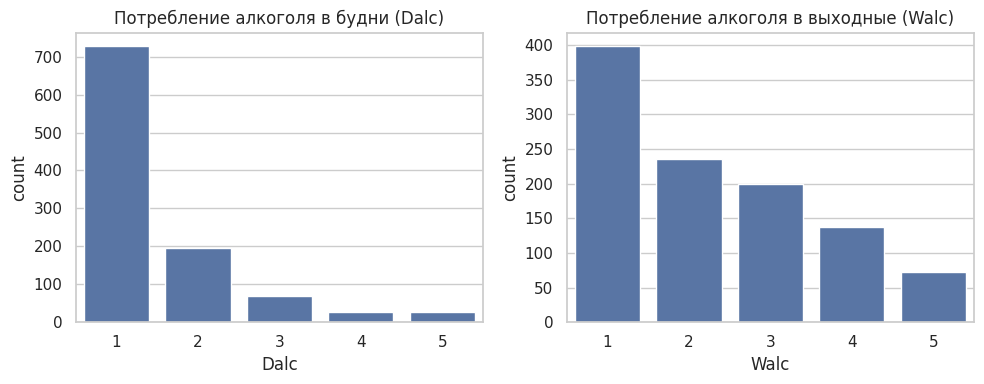
**Рисунок 1.** Распределение уровней потребления алкоголя в будни и выходные.

Вывод: в выходные (`Walc`) распределение смещено в сторону более высоких уровней по сравнению с буднями (`Dalc`).

### 4.2 Dalc и Walc по полу

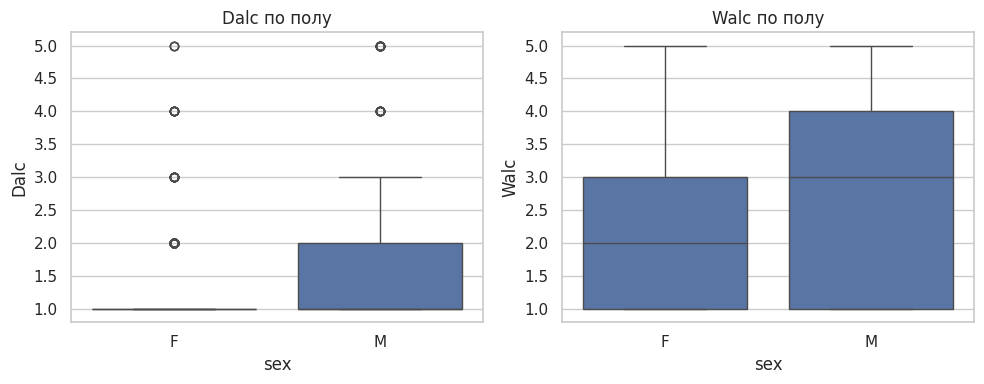
**Рисунок 2.** Boxplot уровней `Dalc` и `Walc` в разрезе пола.

Вывод: у мужской группы медианные и верхние квартильные значения `Walc` выше.

### 4.3 Связь Walc со временем на учебу и пропусками

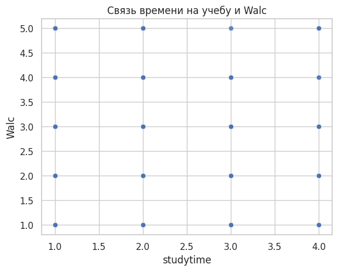
**Рисунок 3.** Scatter `studytime` vs `Walc`.

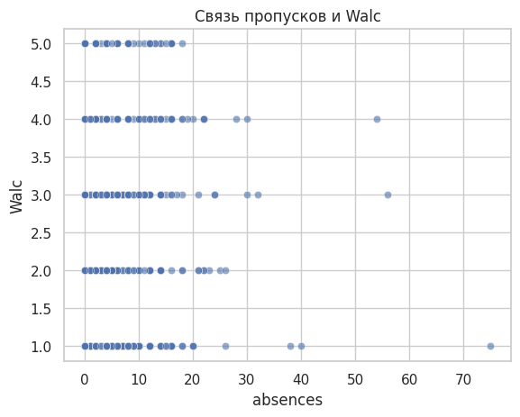
**Рисунок 4.** Scatter `absences` vs `Walc`.

Вывод: зависимость не является строго линейной; при большом количестве пропусков чаще встречаются повышенные уровни `Walc`.

### 4.4 Связь Walc с оценками

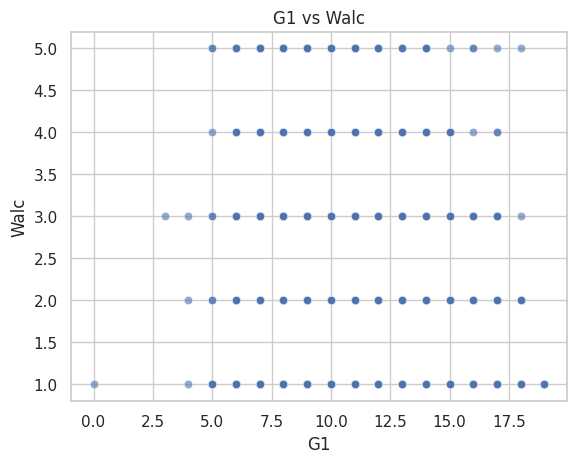
**Рисунок 5.** Scatter `G1` vs `Walc`.

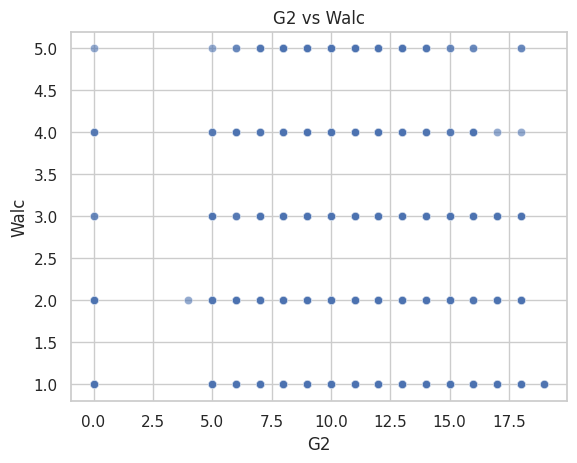
**Рисунок 6.** Scatter `G2` vs `Walc`.

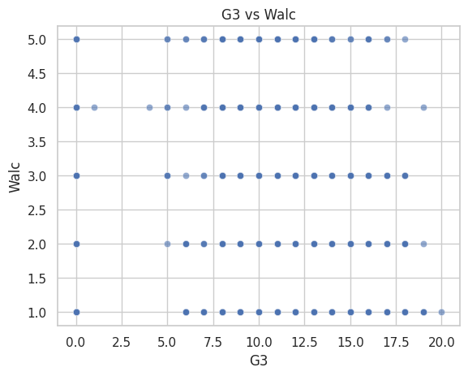
**Рисунок 7.** Scatter `G3` vs `Walc`.

Вывод: у наиболее высоких оценок доля наблюдений с самыми высокими уровнями `Walc` ниже.

---

## 5. Моделирование и сравнение алгоритмов

Рассмотрены модели:
- Logistic Regression (`class_weight='balanced'`),
- RandomForest (`class_weight='balanced'`),
- ExtraTrees (`class_weight='balanced'`),
- SVM RBF (`class_weight='balanced'`),
- HistGradientBoosting (`class_weight='balanced'`),
- XGBoost (`scale_pos_weight`),
- LightGBM (`class_weight='balanced'`),
- CatBoost (`auto_class_weights='Balanced'`).

### 5.1 Результаты при пороге 0.5 (из ноутбука)

| Model | Recall (class 1) | Precision (class 1) | F1 (class 1) | ROC-AUC | PR-AUC |
|---|---:|---:|---:|---:|---:|
| Logistic Regression | 0.7586 | 0.4272 | 0.5466 | 0.8347 | 0.5142 |
| RandomForest (balanced) | 0.4138 | 0.9600 | 0.5783 | 0.9255 | 0.8275 |
| **ExtraTrees (balanced)** | **0.7241** | **1.0000** | **0.8400** | **0.9406** | **0.8911** |
| SVM RBF (balanced) | 0.7241 | 0.4000 | 0.5153 | 0.8104 | 0.5467 |
| HistGradientBoosting | 0.7586 | 0.6984 | 0.7273 | 0.9095 | 0.8219 |
| XGBoost | 0.8103 | 0.6184 | 0.7015 | 0.8923 | 0.7370 |
| LightGBM | 0.7931 | 0.6571 | 0.7188 | 0.9082 | 0.8058 |
| CatBoost | 0.7931 | 0.5750 | 0.6667 | 0.8777 | 0.7079 |

### 5.2 Дополнительная визуализация сравнения моделей

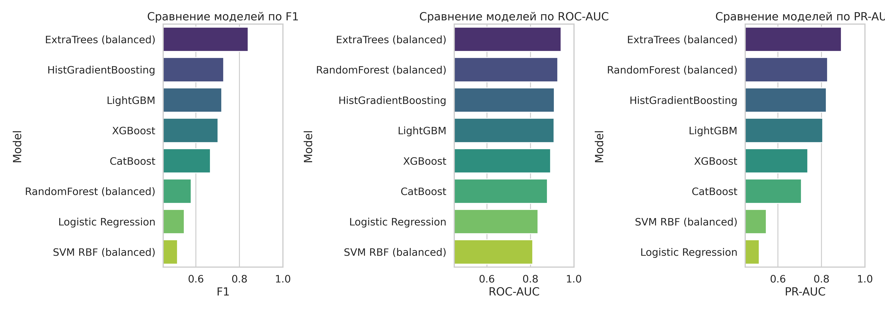
**Рисунок 8.** Сводное сравнение качества всех протестированных моделей.

---

## 6. Выбор финального решения: ExtraTrees

### 6.1 Почему выбрано ExtraTrees

Итоговое решение принято в пользу `ExtraTrees` по совокупности причин:
1. Лучшая метрика `F1` для целевого класса при пороге по умолчанию (`0.8400`).
2. Лучшие значения `ROC-AUC` (`0.9406`) и `PR-AUC` (`0.8911`) в сравнении.
3. Высокая устойчивость на табличных данных и хорошая обобщающая способность.
4. Простота воспроизводимости и интерпретации через важности признаков.
5. Адекватное время обучения на доступном объеме данных.

### 6.2 ROC/PR-кривые для моделей, доступных в окружении

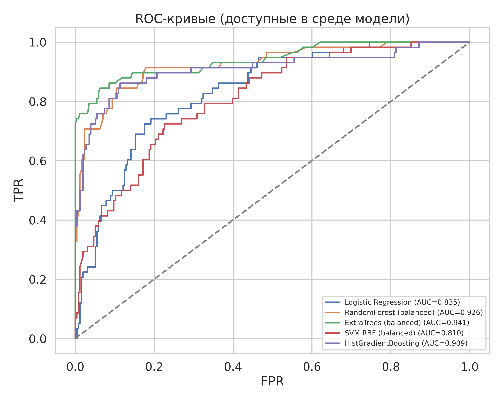
**Рисунок 9.** ROC-кривые (LogReg, RF, ExtraTrees, SVM, HistGBM).

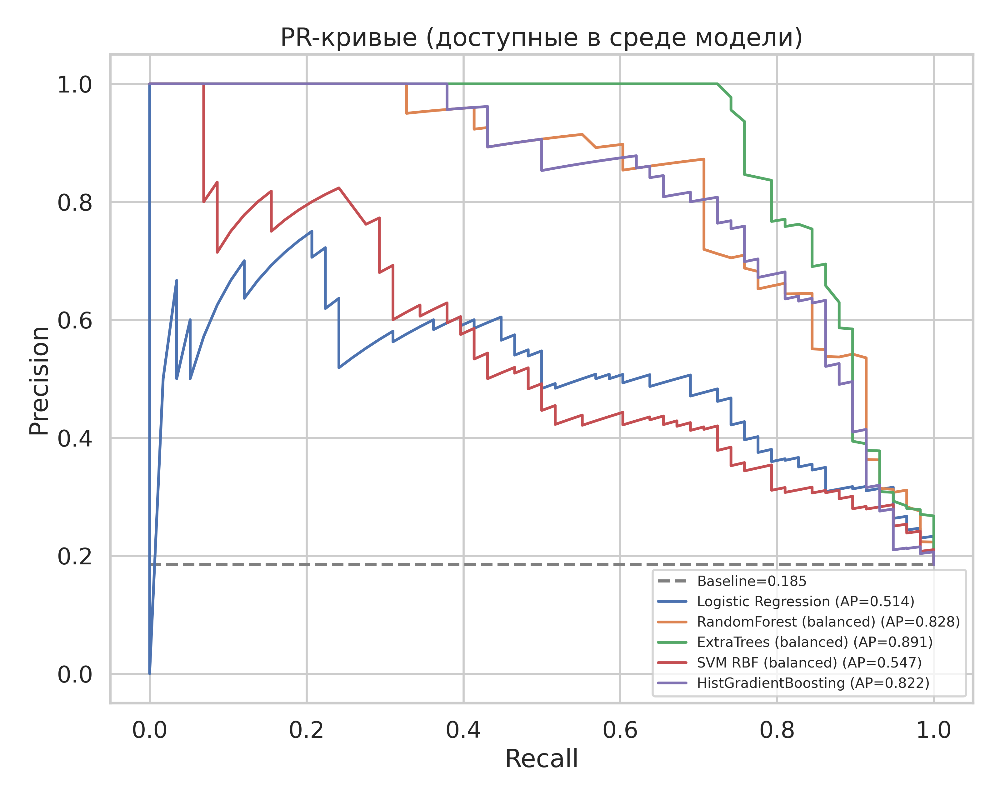
**Рисунок 10.** PR-кривые (LogReg, RF, ExtraTrees, SVM, HistGBM).

### 6.3 Подбор порога для ExtraTrees

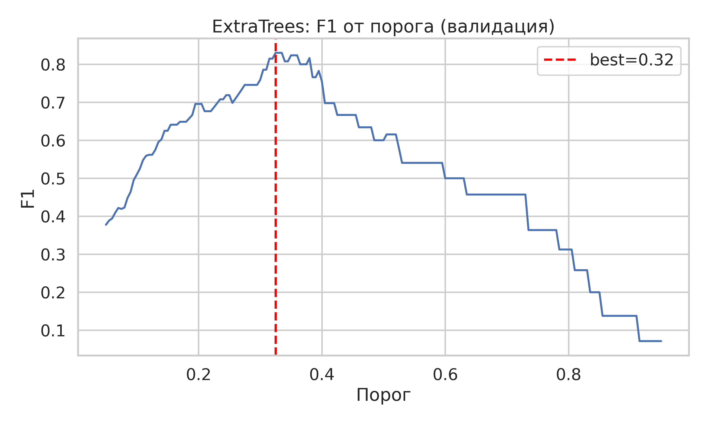
**Рисунок 11.** Зависимость `F1` от порога вероятности на валидации.

Оптимальный порог по валидации: **~0.32**.

### 6.4 Confusion matrix до/после подбора порога

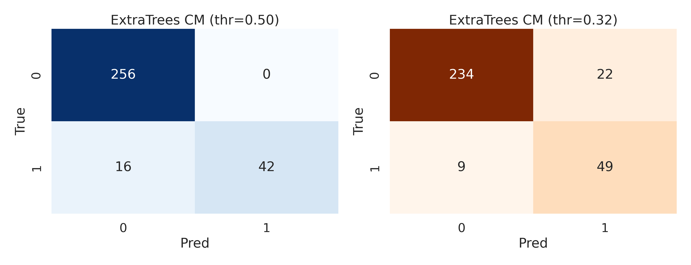
**Рисунок 12.** Матрицы ошибок `ExtraTrees` при порогах `0.50` и `~0.32`.

Интерпретация:
- при снижении порога растет полнота (recall),
- при этом обычно снижается precision,
- итоговый баланс регулируется выбранной бизнес-целью.

### 6.5 Важность признаков ExtraTrees

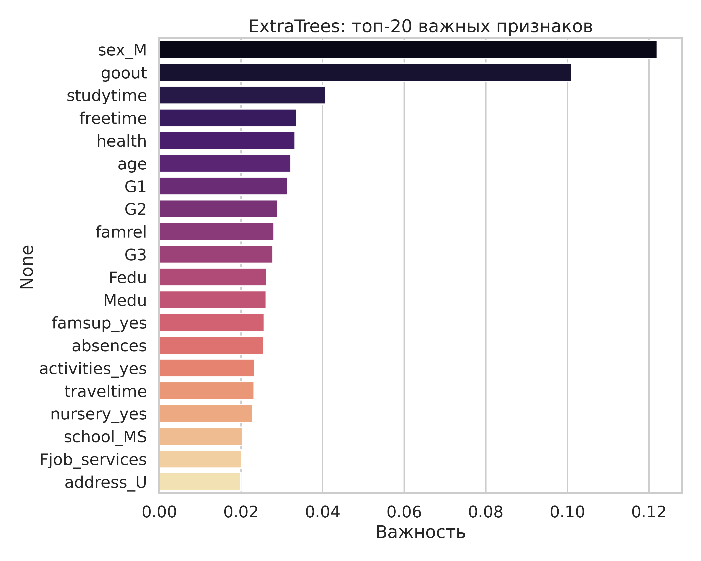
**Рисунок 13.** Топ-20 наиболее значимых признаков по `feature_importances_`.

---

## 7. Результаты экспериментов

### 7.1 Ключевые выводы

1. Даже без прямых прокси-признаков (`Dalc`, `Walc`, `alc_mean`) модель уверенно выделяет группу риска.
2. Наилучший компромисс по метрикам показал `ExtraTrees`.
3. Подбор порога позволяет управлять trade-off между precision и recall без изменения модели.

### 7.2 Финальная рекомендация

В качестве production-кандидата в рамках данной работы рекомендуется:
- модель `ExtraTreesClassifier(n_estimators=300, class_weight='balanced', random_state=42)`,
- рабочий порог вероятности:
  - `0.50` для более консервативного сценария,
  - `~0.32` для сценария, где важнее не пропускать риск.

---

## 8. Заключение

В курсовой работе выполнен полный цикл решения задачи бинарной классификации:
- подготовка данных,
- EDA,
- сравнение нескольких семейств алгоритмов,
- выбор и углубленный анализ финальной модели.

Итогом является готовое и воспроизводимое решение на `ExtraTrees`, дополняемое набором иллюстраций для последующей сборки финального документа.

---

## 9. Список литературы

1. Cortez P., Silva A. Using Data Mining to Predict Secondary School Student Performance. UCI Machine Learning Repository.  
2. Документация scikit-learn: RandomForest, ExtraTrees, HistGradientBoosting, metrics.  
3. Документация XGBoost, LightGBM, CatBoost.  
4. Fawcett T. An introduction to ROC analysis. Pattern Recognition Letters.

---

## 10. Приложение: список рисунков

1. `report_images/01_notebook_graph_cell5_out1.png`  
2. `report_images/02_notebook_graph_cell8_out1.png`  
3. `report_images/03_notebook_graph_cell11_out1.png`  
4. `report_images/04_notebook_graph_cell11_out2.png`  
5. `report_images/05_notebook_graph_cell14_out1.png`  
6. `report_images/06_notebook_graph_cell14_out2.png`  
7. `report_images/07_notebook_graph_cell14_out3.png`  
8. `report_images/08_model_comparison_from_notebook_metrics.png`  
9. `report_images/09_roc_curves_available_models.png`  
10. `report_images/10_pr_curves_available_models.png`  
11. `report_images/11_extratrees_threshold_curve.png`  
12. `report_images/12_extratrees_confusion_matrices.png`  
13. `report_images/13_extratrees_feature_importance_top20.png`
